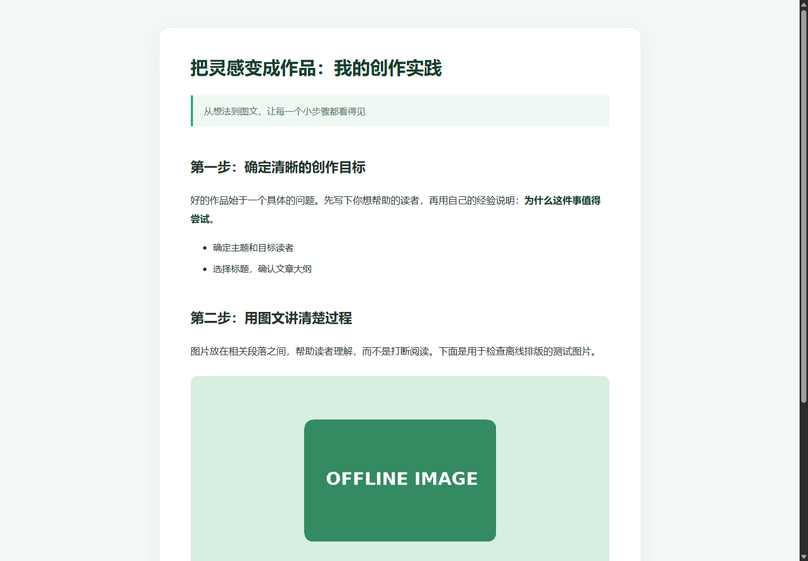

# AI Agent 全栈图文创作平台

输入主题，选择标题和大纲，自动生成正文与配图，最后给出 AI 审稿建议。支持管理员在网页配置文字与图片模型，图片保存在本机持久卷中。

项目仓库：[jifeng-2025/ai-agent-content-platform](https://github.com/jifeng-2025/ai-agent-content-platform)。技术栈为 Java / Spring Boot、Vue 3、MySQL、Redis 和 Docker Compose。

> 当前是可体验的开发候选版，尚未发布正式 v0.1.0。默认配图为演示占位，不是免费 AI 生图，不保证与正文语义匹配。真实文字和图片服务可能收费。

## 现在如何创作

1. 输入主题，生成并选择一个标题。
2. 选择后续使用的**文字模型**、**配图供应商**和 **1–5 张图片**。
3. 生成、编辑并确认大纲，开始图文创作。
4. 正文以打字机式流式展示；配图等待显示旋转圆环，不虚构进度百分比。
5. 图片放在相关正文段落附近，生成完毕后提供一次 **AI 评审建议**，不要求人工接受才出稿，也不自动改写正文。
6. 可在配图旁点击“重试 / 修改提示词”，只调整目标图片；审稿失败时可单独重试建议。
7. 在文章详情页下载图文 ZIP、离线 HTML 或单文件 MD。

图片位置由程序根据正文段落选择并持久保存，提示词带入对应章节和段落；单图重试保留原位置。画面是否真正符合内容仍需人工检查。审稿使用可复用的 [article-advisory-review Skill](src/main/resources/skills/article-advisory-review/SKILL.md)，检查表达、结构和风险，**不代表联网事实核查，也不代表已完成视觉审查**。

顶部导航：首页 → 创作 → 历史 → 管理 → 数据 → 模型设置。管理、数据和模型设置仅对管理员显示。

## 模型设置

没有模型 Key 也可以启动、登录；创建真实文字任务前需要配置文字模型。管理员登录后进入“模型设置”，无需修改 `.env` 即可新增配置、轮换 Key 和选择默认模型，新任务使用新配置。

| 用途 | 已适配协议 | 说明 |
|---|---|---|
| 文字 | 百炼 DashScope | 保留原有文字模型支持 |
| 文字 | DeepSeek / 火山方舟兼容聊天 | 用于标题、大纲、正文和审稿；不是生图接口 |
| 图片 | demo | 默认，无图片 Key；受限图库不可用时绘制 PNG 占位图，明确标记演示 |
| 图片 | 豆包 / Seedream | 火山方舟 `images/generations` 图片接口 |
| 图片 | Gemini 原生 | 可选增强，使用对应 Google 图片模型及凭据 |

使用火山方舟时，文字与图片配置的 Base URL 均可填写 `https://ark.cn-beijing.volces.com/api/v3`，后台按协议调用不同接口。模型 ID 填账户实际开通的模型或接入点 ID，不能把 DeepSeek 聊天模型当作 Seedream 生图模型。DeepSeek 官方账户使用 `https://api.deepseek.com`；各供应商 Key 不通用。

只需配置自己要用的一家图片供应商，不要求同时购买 Gemini 和豆包。普通创作请求不能覆盖后台接口地址；未配置的供应商前后端均禁止选择，失败不会自动切换到另一家收费服务。

Key 仅在后端使用，加密存入数据库；接口不返回完整 Key，浏览器不保存 Key。编辑时留空表示保留，清除须显式确认。主密钥首次需要时生成并保存在独立受限卷中，不要求用户手工填写第三个服务 Key。模型配置版本与任务绑定，在途恢复不会因默认配置变化而悄悄换供应商。

“格式检查”不收费，但不是连接成功；“实际测试”需自行确认，可能收费，不自动重试。配置和安全细节见 [管理员模型设置](docs/agent/model-settings.md)。

## 本地快速启动

准备 Docker Desktop（Linux 引擎）、Docker Compose 和 Node.js，在仓库根目录执行：

```powershell
node tools/init-local-env.mjs
docker compose up -d --build
```

初始化工具仅在 `.env` 不存在时生成随机数据库密码，保留已有配置；缺少前端同源配置时补齐。不要把 `.env`、Key 或私有备份提交 Git。

默认打开 **http://localhost**。使用已有管理员账号进入“模型设置”；普通注册账号不会自动成为管理员，新安装需按自己的管理流程授予管理员权限，不提供公开默认管理员密码。自定义前端端口时，`MODEL_ADMIN_ORIGIN` 必须与浏览器地址的协议、主机、端口一致。外部访问需正确配置 HTTPS；默认端口只绑定回环地址。

默认 `/create` 是“选标题 → 确认大纲 → 图文 → 建议”的简化流程，使用持久任务执行，不需要开启旧评审阻断流程。旧高级入口 `/create/advanced` 保留；其评审 Loop、人工操作和 Runtime 开关 `REVIEW_LOOP_ENABLED`、`INTERVENTION_ENABLED`、`RUNTIME_ENABLED` 默认关闭，仅在使用旧流程时按需开启。详见 [创作契约](docs/agent/quick-creation.md)。

### 更新现有环境

先完成当前任务，并备份数据库、图片和模型主密钥。已具备本轮数据库结构的环境可执行：

```powershell
git pull --ff-only
docker compose up -d --build backend frontend
```

只更新导航等前端代码时：`docker compose up -d --build --no-deps frontend`。随后刷新网页，导出文件需重新下载。

空数据库由 Compose 初始化 SQL；**旧数据库不会因为重建容器自动迁移**。旧版本需依次补齐尚未应用的 `add_article_review.sql`、`add_article_intervention.sql`、`add_article_runtime.sql`、`add_local_image_storage.sql`、`add_image_providers.sql`、`add_model_settings.sql`，先备份再执行，具体命令见 [升级说明](docs/agent/model-settings.md)。不要对已有库重放建库脚本，不使用 `down -v` 升级。

## 本地图片与备份

默认 `IMAGE_STORAGE=local`，**无需 COS Key 或桶**；COS 仅为可选兼容实现，旧 COS 链接与旧文章保留，不自动搬迁或删除。

| 内容 | Compose 持久卷 | 容器位置 |
|---|---|---|
| 文章、用户、配置与执行记录 | `ai-passage-mysql-data` | MySQL 数据目录 |
| 本地配图 | `ai-passage-image-data` | `/data/images` |
| 模型配置加密主密钥 | `ai-passage-model-secrets` | `/data/model-secrets` |

备份和迁移必须同时保留数据库、图片与对应主密钥；只复制数据库无法解密原 Key。容器重建保留命名卷，但删除卷会丢失数据。不要将备份放到 Git 或公开目录，也不要设置全目录 `chmod 777`。

图片使用随机对象 ID、原子写入和受限目录，转换为经过校验的 PNG；拒绝主动 SVG/HTML。站内图片通过鉴权接口读取，不公开整个磁盘。生成结果先留存；图片保存失败时优先复用已收到的结果，不因为保存失败自动再次收费生成。供应商请求结果不确定时暂停确认，不承诺跨供应商 exactly-once。

## 三种导出方式

| 导出 | 如何使用 | 图片兼容性 |
|---|---|---|
| **图文 ZIP（推荐）** | 完整解压，包含 `article.md`、`images/` 和 `index.html` | MD 使用标准相对路径；保留图片文件夹，可离线查看 |
| **网页 HTML** | 双击打开单个文件 | 内嵌本地图片，带阅读排版，适配桌面和手机 |
| **单文件 MD** | 在支持内嵌图片的 Markdown 编辑器中预览 | 使用 data 图片，部分编辑器/平台不支持，建议改用 ZIP |

历史列表默认下载图文 ZIP，详情页可选三种格式。**Markdown 源码模式只显示语法**：VS Code 打开 ZIP 内的 `article.md` 后按 `Ctrl+Shift+V` 预览，不要单独移走 `images/` 文件夹。

HTML 支持常用标题、段落、强调、列表、引用、代码块与配图排版，不执行文章原始 HTML；暂不承诺完整 GFM 表格与嵌套列表。旧外链图片仍可能需要联网，不宣称已离线打包。

以下是本地合成样例的离线排版检查，非真实模型质量证明：



## 平台能力

- **基础创作**：标题方案、大纲、正文、多种配图、文章管理及 Markdown 导出。
- **创作与模型管理**：网页多模型配置、文字模型选择、1–5 张段落配图、流式简化创作、末尾审稿 Skill、单图提示词重试、本地持久图片、离线导出及导航调整。
- **可靠执行与高级流程**：持久状态、检查点、租约/fence、取消、预算、SSE 恢复；旧高级流程保留结构化评审、最多两次局部修订、版本比较和人工处理。
- **尚未实现**：B 的 Research/RAG、偏好记忆、产品 MCP；H1 自动开发调度；D1 自动 CI/GHCR 发布和服务器部署。现有 Compose 启动不等于自动部署平台。

## 验证范围

开发验证默认使用 Mock 云边界。最近几轮专项结果分别为：配图与存储 36 项、模型选择/审稿 47 项、审稿恢复 52 项、最新离线导出 29 项通过；这些是不同版本的专项结果，**不能合并为当前版本完整 A4 全绿**。最新导出后端打包、前端类型检查通过，合成离线样例在真实浏览器断网状态下检查桌面/手机，截图已查看。

- [最新离线导出结果](artifacts/offline-export/report.md)
- [审稿修复](artifacts/advice-timeout/report.md)
- [文字模型与配图数量](artifacts/composition-options/report.md)
- [A4 阶段报告及历史限制](artifacts/a4/report.md)
- [当前状态](docs/agent/status.md)

可复用验证入口：

```powershell
node tools/dev-harness/run.mjs a3-providers
node tools/dev-harness/run.mjs a3-mock
```

完整安装、升级、用户页面和真实供应商体验由用户手动验收。用户已反馈真实图文使用情况，但未形成当前源码统一版本的完整收费 API 验收报告；代理未另行调用真实 Key。不要把 Mock 或配置存在视为账户调用验证。既有 `contextLoads` 配置问题及历史 lint 16 错误/1 警告未作为本轮顺手全仓修复，不宣称全仓全绿。详细原始日志、运行目录、缓存、真实用户导出及私密配置不进入 Git；公开报告保留范围和限制。

## 署名与许可

保留上游作者链接、代码署名和历史。本地已有的 MIT 徽章线索尚未补齐对应版本的完整许可正文与适用范围；本项目不擅自补发 MIT/Apache 许可证，也不把公开仓库等同于任意再分发或商业使用许可。详见 [授权核查记录](artifacts/a4/license-review.md)。本次源码更新不代表正式版本发布或分发授权核查已完成。

基于 [鱼皮 / 编程导航 yuyuanweb/ai-passage-creator](https://github.com/yuyuanweb/ai-passage-creator) 改造，保留上游署名与 Git 历史。
