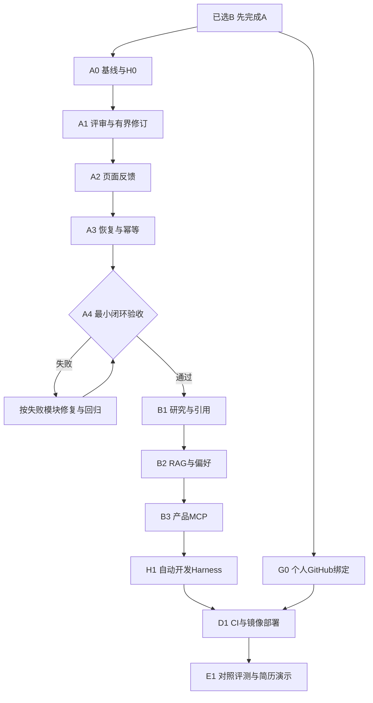

# 完整开发步骤与新会话提示词
本文件供排期/发起新任务使用；普通开发不必全文读取。方案已选B，执行顺序先A后B。

## 阶段与读入范围

| 顺序/编号 | 实施内容 | 主模块 | 验收/交付 |
|---|---|---|---|
| 1 G0 | 个人GitHub仓库绑定（需目标URL/可见性） | 50 | 目标权限、Git认证、远端SHA可核验；不阻塞本地A0 |
| 2 A0 | 运行路径、构建/测试基线、5个固定案例、H0入口 | 00；新增验证需40 | 可重复命令、baseline报告、明确现有失败；不先升级框架 |
| 3 A1 | Reviewer/Revision结构与最多两轮循环 | 10 | 通过/修订/达限/非法响应分支测试 |
| 4 A2 | 页面显示轮次、问题、版本、人工出口、图片降级/重试 | 10；浏览器测试需40 | 桌面/手机实操、截图、错误检查 |
| 5 A3 | 检查点、幂等、SSE恢复、取消/超时/预算、日志 | 20 | 中断/重复请求/配图故障注入验证 |
| 6 A4 | A端到端验收、Compose更新、5案例对比 | 10+40；部署/指标按需50/60 | 10模块八项门槛通过，形成第一个可演示版本 |
| 7 B1 | Research工具、证据模型、引用侧栏、补证据路由 | 30；接口/状态需20 | 10个研究案例、真实来源与缺证据出口 |
| 8 B2 | 小资料库RAG、按需上下文、用户偏好CRUD | 30 | 检索对照、引用定位、用户隔离 |
| 9 B3 | 一个真实产品MCP工具适配 | 30 | 协议调用证据、断连/权限/参数错误测试 |
| 10 H1 | Codex SDK/exec调度、独立验证、反馈修复与预算 | 40 | 3个开发任务、至少1次发现/修复/回归演示 |
| 11 D1 | CI、版本镜像、发布Compose、备份/回滚 | 50 | CI通过；固定版本部署与数据保留验证 |
| 12 E1 | 对照评测、演示视频、架构图、贡献说明 | 60 | 20主题含5留出案例，真实指标、失败案例、简历证据 |

G0可与A0准备并行；D1的最小CI可以在A0后提前，完整镜像发布在A4后按需推进。不得因个人远端尚未确定而停止本地开发。一次新聊天处理一个编号，用户明确组合时才跨阶段。

## 开发流程图



每一任务都执行：需求/验收 → 按需读文档/代码 → 实现 → 测试 → 运行 → 浏览器与视觉检查（UI任务）→ 修复 → 回归 → 更新status → 用户要求时推送。后端任务不强制做无关截图；只修文档不启动业务服务。

## 新聊天第一条提示词（A0）

```text
项目路径：D:/2026codex/ai-passage-creator。
方案已确认B，先完成A的最小闭环。本次只执行A0，不扩展到A1或B。

先读AGENTS.md、agent.md和docs/agent/status.md，
然后只读docs/agent/00-baseline.md；
建立开发验证入口时按需补读docs/agent/40-dev-harness.md，
不要读取全部模块或重新询问选型。

检查Git状态和实际Controller→Service→Agent编排路径，
确认当前启动方式、构建/类型检查/测试基线。
建立5个固定创作案例、可重复的验证入口与基线报告，
区分Mock回归和真实API冒烟，不改动正在使用的数据。
记录现有失败与开发阻塞，不通过删除测试来绕过。
最后更新status.md，交付改动、验证证据和A1建议。
本次不创建新聊天、不自动推送、不部署服务器。
```

## 后续通用任务提示词

```text
在D:/2026codex/ai-passage-creator执行任务<A1/A2/A3/...>。
方案B、先A；只读AGENTS.md、agent.md、status.md和路由表指定模块，
必要依赖再补读。先检查上一任务证据与当前代码，不重复已完成工作。
按模块验收标准完成实现→测试→运行→适用的浏览器/视觉检查→修复→回归。
保护现有数据，保留兼容性，更新status.md和受影响的设计模块。
交付实际修改、验证证据和剩余限制，不把计划标为完成。
```

## 上传任务提示词

```text
将本次已验证改动上传到我的已绑定GitHub仓库。
读取agent.md、status.md、50-github-deploy.md，核验目标owner/repo和写权限；
检查暂存内容与敏感信息，只提交本次相关文件，推送功能分支，
再通过GitHub MCP核验远端SHA。需要PR时按我的要求创建。
如果尚未绑定个人仓库，先列明缺失的目标URL/可见性，不向上游origin推送。
```

## 已有与新增

| 能力 | 已有 | A新增 | B/H1/D1新增 |
|---|---|---|---|
| 创作界面 | 标题、大纲、正文、配图、历史 | 问题列表、版本、人工出口 | 证据侧栏/资料库 |
| 编排 | 分阶段StateGraph固定边 | Reviewer/Revision有限回环 | 工具驱动研究、补证据路由 |
| 可信度 | 生成内容，未建立证据链 | 无依据论断风险处理 | 来源、claim关联、引用支持评测 |
| 状态 | ArticleState；配置中有MemorySaver | 持久检查点、幂等、恢复、取消 | 研究/工具状态统一恢复 |
| 图片 | 多策略与Picsum降级 | 明确占位、单图重试 | 语义匹配评审 |
| SSE/日志 | 流式事件、AgentLog | 重连去重、轮次、预算、错误分类 | token/成本/来源追踪完善 |
| Memory/RAG | 无本次已验证完整实现 | 暂不增加 | 资料检索、偏好CRUD |
| GitHub MCP | 已连接jifeng-2025 | G0绑定个人项目 | PR/CI核验 |
| 产品MCP | 未确认已有 | 暂不增加 | 一个真实工具接入 |
| 开发Harness | 无已验证项目级实现 | H0固定命令/浏览器/反馈流程 | H1可执行调度与独立验收 |
| 部署 | 四容器Compose + Dockerfile | 保持一条启动命令与数据 | CI、GHCR、版本部署/回滚 |
| 测试/简历 | 存在基础测试，覆盖未验证 | 5固定案例和故障注入 | 对照评测、量化结果/演示 |
